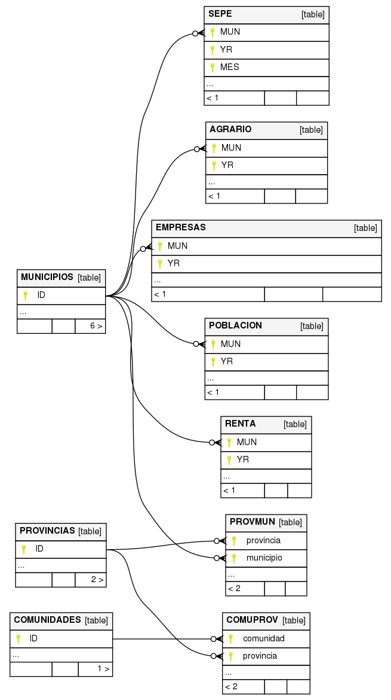

El objetivo de este proyecto es generar una base de datos con datos abiertos
de municipios españoles, principalmente datos geográficos y socioeconómicos.

# Requerimientos

```console
$ sudo apt-get install p7zip-full
$ sudo apt-get install spatialite-bin
$ sudo apt-get install libsqlite3-mod-spatialite
$ sudo apt-get install mdbtools
$ sudo pip install -r requirements.txt
```

# Aviso

Aunque los `json` generados son fieles a las fuentes, en la base de datos
se han hecho las siguientes transformaciones para facilitar la comparación
de los datos a lo largo del tiempo:

* Si varios municipios se han fusionado en uno solo, se reconstruye la
fusión retroactivamente (agregando los datos de los municipios originales)
de manera que en la base de datos solo figura el municipio resultando
de la fusión
* Si un municipio se desgaja en varios y aparecen datos de los nuevos
municipios en alguna fuente antes que en el propio INE, se reconstruye,
para esas fuentes, el municipio original (antes de desgajarse) para que no
aparezca hasta que también salga en el INE.

Con el mismo animo de facilitar la comparación, solo se cargan datos
hasta el último año completo, de manera que si estamos a mediados de
2019, la base de datos solo tendrá datos hasta final de 2018.

Además solo se cargan datos hasta el último año en el que INE haya publicado
las estadísticas de población.

# Base de datos SQLite

Esta base de datos usa [SpatiaLite](https://www.gaia-gis.it/fossil/libspatialite/index)
para proporcionar información geográfica.

## Diagrama de las tablas principales de la base de datos SQLite



## ¿Qué es la AREA_INFLUENCIA?

En algunos desarrollos no solo vamos a querer usar los datos de un municipio
si no también los de sus alrededores. Por ejemplo, podemos querer calcular
el nivel de vida de un municipio en función del paro y renta, pero no solo
teniendo en cuenta los valores de dicho municipio, si no también una porción
de dichos valores en los municipios a 10km a la redonda.

Para facilitar este caso de uso tenemos la tabla `AREA_INFLUENCIA` en la cual
las tuplas `<A - B - 10 - 0.12>` y `<A - C - 10 - 0.20>` significan que si trazamos
una circunferencia de 10km a la redonda desde el centro del municipio
`A` esta interaccionará con un 0.12 del área del municipio `B` y un 0.20 del área del municipio `C`,
de manera que el paro del `área de influencia formado por A y 10km a la redonda`
será el paro de `A` + (0.12 * el paro de `B`) + (0.20 * el paro de `C`).
